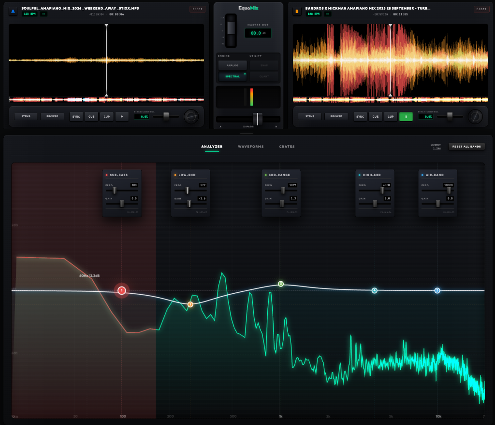

# EquoMix

EquoMix is a reference-grade DJ workstation specializing in advanced equalization and spectral sculpting. It features a unique dual-engine EQ system that allows you to switch between traditional Analog (IIR) and high-precision Spectral (FFT-Linear) processing for phase-accurate sound sculpting and studio-grade performance.



## 🚀 Key Features

### 🎚️ Dual-Engine Master EQ
The heart of EquoMix is its versatile Master EQ section, featuring two distinct DSP architectures:
- **Analog (IIR) Mode**: Mimics classic hardware behavior using minimum-phase Biquad filters. Warm, musical, and zero-latency.
- **Spectral (FFT) Mode**: A professional linear-phase engine using Fast Fourier Transforms. Perfect for transparent mixing without phase distortion.

### 💿 High-Precision Decks
- **5-Band Spectral Separation**: Every track is analyzed in the background to create high-density spectral waveforms across five frequency bands (Sub, Low-Mid, Mid, High-Mid, Air).
- **Electronic Safety Locks**: Transport controls (Play, Cue, Sync) are electronically locked until tracks are fully buffered and analyzed, ensuring 100% glitch-free performance.
- **Smart Eject**: Dedicated safety-eject system to fully flush memory and reset deck state.
- **Hardware-Like Controls**: Integrated jog wheels with rotation tracking and high-precision pitch faders with scroll-wheel support.

### 🧪 Advanced Visualization
- **Overlapping Spectrums (`ANALYZER`)**: Real-time dual FFT curves (Deck A & B) with signal-aware additive blending. Visualizes frequency clashes instantly with bright glowing overlap indicators.
- **Stacked Pro-Waveforms (`WAVEFORMS`)**: Parallel, dual-scrolling spectral waveforms with a unified high-precision central playhead and background rails for surgical beatmatching.
- **Discrete Channel Monitoring**: The Master VU meters act as individual signal monitors for Deck A and Deck B, providing precise visual gain staging.

### 🗄️ Volatile Session Crates
- **Link Session Folder**: Instantly point the workstation to a local directory using the File System Access API. 
- **Zero-Footprint**: Deep-scans folders for audio files and creates volatile object URLs that are destroyed on exit, leaving no persistent data behind.

## 🛠️ Technical Stack
- **Core Engine**: Web Audio API (Advanced DSP Routing).
- **Processing**: [fft.js](https://github.com/indutny/fft.js) for high-performance spectral calculations.
- **Offline DSP**: `OfflineAudioContext` for background 5-band channel separation.
- **Visuals**: HTML5 Canvas API with hardware-accelerated rendering.

## 📥 Getting Started

### Prerequisites
- [Node.js](https://nodejs.org/) (Latest LTS recommended)
- A modern browser with Web Audio support (Chrome/Edge/Safari/Firefox)

### Installation
1. Clone the repository and install dependencies:
   ```bash
   npm install
   ```

2. Launch the studio:
   ```bash
   npm run dev
   ```

## 🎮 How to Use
1. **Load Media**: Click "LINK FOLDER" in the Crates tab to temporarily link your local tracks.
2. **Beatmatch**: Use the **WAVEFORMS** tab to visually align kick transients on the glowing central playhead.
3. **Sculpt**: Monitor the **ANALYZER** tab for frequency clashes and use the EQ cards to cut overlapping bands. 
4. **Monitor**: Watch the central Master VU meters—the left meter monitors Deck A and the right meter monitors Deck B.

---
*EquoMix – Reference Grade DJ Workstation. Built for the future of web audio.*
