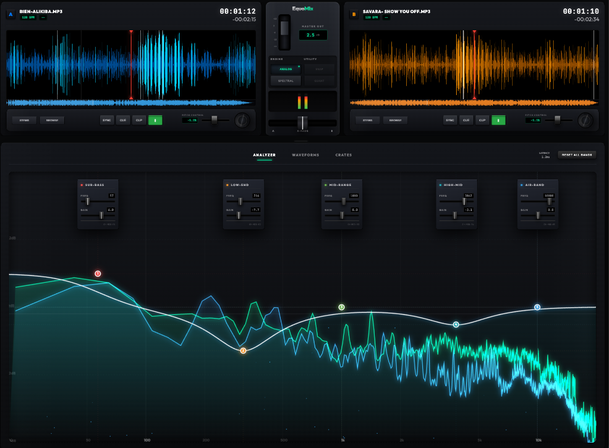

# EquoMix

EquoMix is a high-fidelity DJ workstation specializing in advanced equalization. It features a unique dual-engine EQ system that allows you to switch between traditional Analog (IIR) and high-precision Spectral (FFT-Linear) processing for phase-accurate sound sculpting and studio-grade performance.



## 🚀 Key Features

### 🎚️ Dual-Engine Master EQ
The heart of EquoMix is its versatile Master EQ section, featuring two distinct DSP architectures:
- **Analog (IIR) Mode**: Mimics classic hardware behavior using minimum-phase Biquad filters. Warm, musical, and zero-latency.
- **Spectral (FFT) Mode**: A professional linear-phase engine using Fast Fourier Transforms. Perfect for transparent mixing without phase distortion (ideal for mastering).

### 💿 Precision Decks
- **Dual Deck Architecture**: Independent control over Deck A and Deck B.
- **Dynamic Waveforms**: High-performance canvas-based waveform rendering with interactive scrubbing and loading skeleton pulses.
- **Hardware-Like Controls**: Integrated jog wheels with rotation tracking and high-precision pitch faders with scroll-wheel support.
- **Performance Row**: Professional DJ mechanics including tempo **SYNC**, **CUE** (stutter and return), and **CUP** (Cue & Play).

### 🧪 Dual Visualization Engine
- **Overlapping Spectrums (`ANALYZER`)**: Real-time dual FFT curves (Deck A & B) with additive blending. Visualizes frequency clashes instantly with bright glowing overlap indicators.
- **Stacked Waveforms (`WAVEFORMS`)**: Parallel, dual-scrolling time-domain waveforms with a central playhead for precise visual phase alignment and beatmatching.
- **Vocal Kill**: Real-time center-channel subtraction for creating instant acapellas or instrumentals.

### 🗄️ Volatile Session Crates
- **Link Session Folder**: Instantly point the workstation to a local directory using the File System Access API. 
- **Zero-Footprint**: Deep-scans folders for audio files and creates volatile object URLs that are completely destroyed the moment you close the app, leaving no persistent data behind.

## 🛠️ Technical Stack
- **Core Engine**: Web Audio API (Advanced DSP Routing).
- **Processing**: [fft.js](https://github.com/indutny/fft.js) for high-performance spectral calculations.
- **Visuals**: HTML5 Canvas API with hardware-accelerated rendering.
- **Bundling**: [Vite](https://vitejs.dev/) for ultra-fast development and build.

## 📥 Getting Started

### Prerequisites
- [Node.js](https://nodejs.org/) (Latest LTS recommended)
- A modern browser with Web Audio support (Chrome/Edge/Safari/Firefox)

### Installation
1. Clone the repository:
   ```bash
   git clone https://github.com/your-username/EquoMix.git
   cd EquoMix
   ```

2. Install dependencies:
   ```bash
   npm install
   ```

3. Launch the studio:
   ```bash
   npm run dev
   ```

## 🎮 How to Use
1. **Load Media**: Click "LINK FOLDER" in the Crates tab to temporarily link your local tracks, or use "IMPORT FILES" for manual selection.
2. **Beatmatch**: 
   - Hit **SYNC** on the incoming deck to instantly match its tempo to the active deck.
   - Open the **WAVEFORMS** tab to visually align the kick transients on the center playhead.
3. **Perform**: Use **CUE** for stutter starts and **CUP** for instant drops. Use the Crossfader to blend between Deck A and Deck B.
4. **Sculpt Sound**: Watch the **ANALYZER** tab for glowing frequency clashes, and use the EQ cards below to cut overlapping bands. 
5. **Switch Engines**: Toggle between **ANALOG** and **SPECTRAL** in the sidebar to hear the difference in phase response.

## 📄 License
This project is licensed under the MIT License - see the LICENSE file for details.

---
*EquoMix – Reference Grade DJ Workstation. Built for the future of web audio.*
